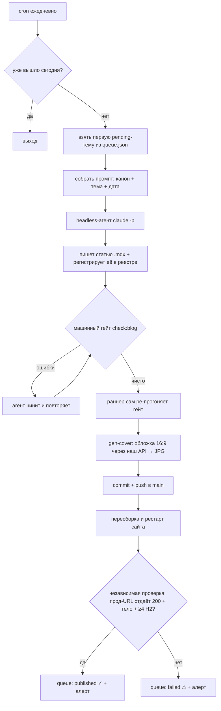

# Как статьи генерируются и публикуются автоматически

Блог aigenway пишется **сам — одна SEO-статья в день, полностью без человека**:
ИИ-агент пишет текст, генерит обложку нашим же API, деплоит на прод и
**сам проверяет**, что статья реально открылась. Ниже — как именно.

---

## Коротко

- **Расписание:** cron на сервере, ежедневно (основной слот + добор).
- **Одна тема — одна статья.** Темы лежат в очереди (`queue.json`).
- **Автор — headless-агент** (`claude -p`): пишет статью по жёсткому канону.
- **Качество держит машинный гейт** — не прошло, статья не выходит.
- **Обложку рисует наш собственный API** (dogfooding).
- **Публикация подтверждается независимой HTTP-проверкой** — раннер не верит
  агенту на слово: статус `published` ставится только после реального `200` с проды.

---

## Сквозной поток

---

## Шаг за шагом

**1. Расписание и защита от дублей.**
Cron запускает раннер ежедневно. Первым делом — блокировка (один прогон за раз) и
проверка «за сегодня уже публиковали?». Если да — тихий выход. Значит добор-слоты
и ретраи безопасны: второй статьи за день не будет.

**2. Выбор темы.**
Раннер берёт **первую `pending`-тему** из очереди `queue.json` (у каждой темы:
ключевик, тип воронки, tags, angle). Очередь пуста → алерт «нужно пополнить темы».

**3. Сборка задания.**
Тема + сегодняшняя дата подставляются в шаблон промпта (`prompt.tmpl`), где прописан
весь канон статьи и правила.

**4. Агент пишет статью.**
Headless-агент (`claude -p`) в один заход:
- пишет файл статьи `<slug>.mdx` (frontmatter + тело);
- **регистрирует её в реестре** (без этого статья нигде не отрендерится);
- сверяется с реальным каталогом моделей (`/v1/methods`) — не выдумывает то, чего
  на шлюзе нет: про недоступные модели пишем честно, как «альтернатива».

**5. Машинный гейт — сердце системы.**
Скрипт `check:blog` проверяет канон: длину title/description, что есть **≥4 раздела
H2**, реальный код-пример (curl к API), конверсионный блок, рабочие внутренние
ссылки, и — главное — что статья **зарегистрирована в реестре**. Не прошло —
публикации нет. Агент чинит и повторяет, пока гейт не зелёный.

**6. Раннер перепроверяет сам.**
После агента раннер **независимо** прогоняет тот же гейт — не доверяет отчёту агента.

**7. Обложка нашим же API.**
`gen-cover` отправляет запрос в наш `/v1/generations` (модель изображений),
дожидается результата, скачивает картинку, сжимает в лёгкий JPG 16:9 (~100 КБ) и
прописывает её в статью. Это заодно живая витрина продукта. Если генерация не
удалась — не блокирует публикацию (статья выйдет с брендовым запасным постером).

**8. Публикация + деплой.**
Раннер коммитит статью и обложку, пушит в `main`, затем пересобирает и
перезапускает сайт, чтобы новая статья попала на прод.

**9. Независимая проверка — единственный источник правды.**
Раннер сам делает `curl` по прод-URL новой статьи и ждёт **реальный `200` с телом и
≥4 заголовками H2**. Только тогда тема помечается `published`. Если страница не
отдалась — тема уходит в `failed` (а не остаётся в очереди), чтобы завтра не написать
дубль на тот же интент. На каждый прогон — алерт (успех / провал / очередь пуста).

---

## Что делает систему надёжной

- **Не верим агенту на слово** — публикация засчитывается только после живого `200`.
- **Машинный гейт** — канон и регистрацию проверяет машина, а не человек.
- **Честность к инвентарю** — «X API» только для моделей, что реально есть; остальное
  как «X alternative».
- **Анти-дубль** — расхождение «отчитался, но не вышло» → `failed`, не повтор.
- **Идемпотентность** — ретраи и добор-слоты безопасны (guard «уже вышло сегодня»).

---

## Темп и очередь

- **1 статья в день**, по порядку очереди.
- Темы — **низкочастотные long-tail** (валидировано по данным keyword-планировщика):
  «X alternative», нишевые модели, код-примеры, сравнения. Пиллар-страницы связывают
  кластеры (hub-and-spoke).
- Пополнять очередь — дописать темы в `queue.json` (есть `queue.mjs add`).
- Каждая статья закрывает читателя на продукт: один API-ключ, prepaid USD, `$5` кредит.

---

## Что человек НЕ делает каждый день

Ничего. Система сама: выбирает тему → пишет → проверяет качество → рисует обложку →
деплоит → убеждается, что статья живая → отмечает в очереди. Человек нужен только
чтобы **пополнять темы** и иногда **смотреть алерты**.
